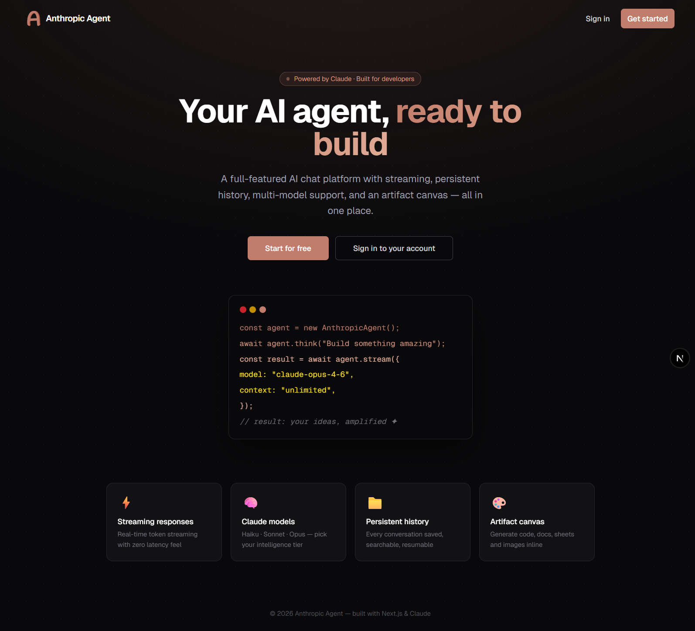
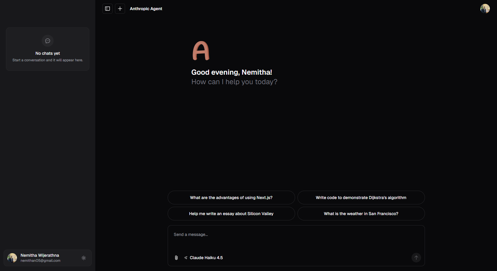

# Anthropic Agent

A full-featured AI chat application built with Next.js and the Anthropic Claude API. Supports multi-model selection, real-time streaming, artifact generation, and persistent chat history backed by Firestore.



---

## Features

- **Multiple Claude models** — Claude Haiku 4.5, Sonnet 4.6, and Opus 4.6, plus Claude Sonnet 3.7 with extended thinking
- **Streaming responses** — Real-time token streaming powered by the Vercel AI SDK
- **Artifact canvas** — Generate and edit code, documents, spreadsheets, and images inline
- **Persistent chat history** — Conversations stored in Firestore, paginated and resumable
- **Authentication** — Email/password and Google Sign-In via Firebase Auth (email verification enforced)
- **Message voting** — Thumbs up/down feedback stored per message
- **Dark / light theme** — System-aware with manual toggle
- **Responsive UI** — Collapsible sidebar, resizable panels, mobile-friendly layout

---

## Tech Stack

| Layer | Technology |
|---|---|
| Framework | Next.js 16 (App Router) |
| AI | Anthropic Claude via `@ai-sdk/anthropic` + Vercel AI SDK |
| Auth | Firebase Auth (client + Admin SDK) |
| Database | Cloud Firestore |
| Storage | Vercel Blob |
| Styling | Tailwind CSS v4 + Radix UI |
| Testing | Playwright |

---

## Getting Started

### Prerequisites

- Node.js 18+
- pnpm
- Firebase project with Firestore and Authentication enabled
- Anthropic API key

### Installation

```bash
git clone https://github.com/nemitha2005/anthropic-agent.git
cd anthropic-agent
pnpm install
```

### Environment Variables

Create a `.env.local` file at the root:

```env
# Anthropic
ANTHROPIC_API_KEY=

# Firebase (client)
NEXT_PUBLIC_FIREBASE_API_KEY=
NEXT_PUBLIC_FIREBASE_AUTH_DOMAIN=
NEXT_PUBLIC_FIREBASE_PROJECT_ID=
NEXT_PUBLIC_FIREBASE_STORAGE_BUCKET=
NEXT_PUBLIC_FIREBASE_MESSAGING_SENDER_ID=
NEXT_PUBLIC_FIREBASE_APP_ID=
NEXT_PUBLIC_FIREBASE_MEASUREMENT_ID=

# Firebase Admin (server-side)
FIREBASE_ADMIN_PROJECT_ID=
FIREBASE_ADMIN_CLIENT_EMAIL=
FIREBASE_ADMIN_PRIVATE_KEY=

# Vercel Blob (optional, for file uploads)
BLOB_READ_WRITE_TOKEN=
```

> The Firebase Admin private key can be obtained from your Firebase project settings under **Service Accounts → Generate new private key**.

### Run Locally

```bash
pnpm dev
```

Open [http://localhost:3000](http://localhost:3000).



---

## Scripts

| Command | Description |
|---|---|
| `pnpm dev` | Start development server with Turbopack |
| `pnpm build` | Production build |
| `pnpm start` | Start production server |
| `pnpm lint` | Lint with Biome |
| `pnpm format` | Auto-fix formatting |
| `pnpm test` | Run Playwright e2e tests |

---

## License

[MIT](LICENSE)
